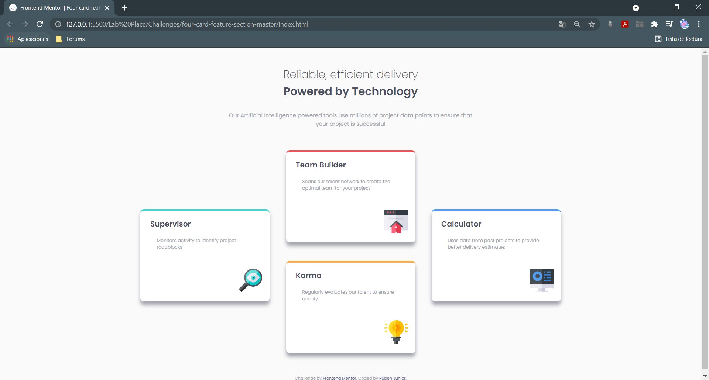

# Frontend Mentor - Four card feature section solution

This is a solution to the [Four card feature section challenge on Frontend Mentor](https://www.frontendmentor.io/challenges/four-card-feature-section-weK1eFYK). Frontend Mentor challenges help you improve your coding skills by building realistic projects. 

## Table of contents

- [Overview](#overview)
  - [The challenge](#the-challenge)
  - [Screenshot](#screenshot)
  - [Links](#links)
- [My process](#my-process)
  - [Built with](#built-with)
  - [What I learned](#what-i-learned)
  - [Continued development](#continued-development)
  - [Useful resources](#useful-resources)
- [Author](#author)
- [Acknowledgments](#acknowledgments)

**Note: Delete this note and update the table of contents based on what sections you keep.**

## Overview
This challenge is about creating a four card feature section that depends on the screen size. So it is about creating a responsive design of a three column with equally-sized cards.
### The challenge

Users should be able to:

- View the optimal layout for the site depending on their device's screen size

### Screenshot



### Links

- Solution URL: [Add solution URL here](https://your-solution-url.com)
- Live Site URL: [Add live site URL here](https://your-live-site-url.com)

## My process

### Built with

- Semantic HTML5 markup
- CSS custom properties
### What I learned

I learned how to use media to transform the style depending on the screen size.

```css
@media only screen and (min-width: 376px){
    h1{
        font-size: 2em;
    }

    h3{
        font-size: 1.35em
    }

    p{
        font-size: 1em;
        width: 35%;
    }

    .info-box {
        width: 350px;
        height: 245px;
        margin: 0px auto;
    }

    .box-paragraph {
        width: 75%;
    }

    .box-img { 
        bottom: 25px;
        right: 20px;
    }

    .center-box{
        display: inline-block;
        margin: 60px 40px 60px 40px;
    }

    .supervisor-box {
        margin: auto;
        display: inline-block;
        position: relative;
        bottom: 140px;
    }

    .karma-box {
        margin-top: 50px;
    }

    .calculator-box {
        margin: auto;
        display: inline-block;
        position: relative;
        bottom: 140px;
    }

}
```


### Continued development

Need more practise on responsive web design.

### Useful resources

- [W3School](https://www.w3schools.com) - This is a good resource where I learned how to use media.
- [MDN Web Docs](https://developer.mozilla.org/) - Another great resource 

## Author
- Frontend Mentor - [@RJProm](https://www.frontendmentor.io/profile/RJProm)
